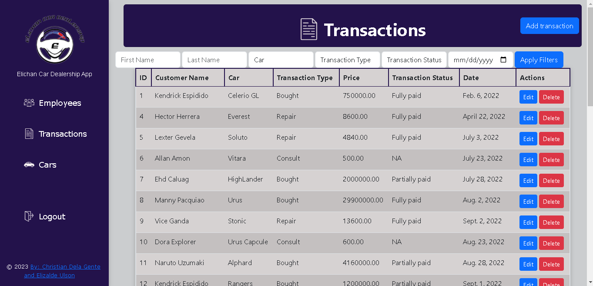

<p align="center"><a href="https://github.com/xchan344" target="_blank"></a></p>

<p align="center">
</a>
</a>
</a>
</a>

<h2> System Features </h2>

- **Sign in & Sign out** - The user can Sign in and Sign out using Registered accounts into the system. this is a security feature to prevent unregistered users from accessing the system.

- **CRUD** - The system has CRUD features:
    1. Create - The user can Add Employee Data, Transaction Data, and Car Data into the system.
    2. Read - The user can view the data from the system's database in the System's webpage.
    3. Update - The user can make changes on the existing data in the databese using this system.
    4. Delete - The user can remove existing data that is irrelevant in the current database.

<br> </br>
- **Sales Calculation** - The user can view the Total Earnings, Total Sales Earnings, Total repair earnings, and Total consult earnings on the top side of the system.

- **Bar Graph Visualization** - The user can view Transaction data in the form of graphs to help better visualize the information.

- **Filter** - The user can filter results so that they can better search for specific Data results.

<br></br>

## Visuals


*The image above shows the Sign Up Page*

<br> </br>


*The image above shows the Sign In Page*

<br> </br>


*The image above shows the Home Page*

<br> </br>


*The image above shows the Employee Page*

<br> </br>



*The image above shows the Transaction Page*

<br> </br>


*The image above shows the Car Model Page*

<br> </br>


*The gif above shows the working project*

<br> </br>

# Installation

1. Fork the Repository From [xchan344](https://github.com/xchan344/Laravel-Elichan-Cardealership-App) github repositories

2. To install Django, you can follow these steps:

Step 1: Set Up Python

Make sure you have Python installed on your system. Django requires Python 3.6 or higher. You can check your Python version by running the following command in the terminal or command prompt:

```
python --version
```


Step 2: Create a Virtual Environment (optional but recommended)
It's a good practice to create a virtual environment for each Django project. A virtual environment allows you to isolate dependencies and avoid conflicts between different projects.

Open your terminal or command prompt and navigate to the desired directory where you want to create your project. Then, run the following command to create a virtual environment:

```
python -m venv myenv
```

Replace `myenv` with the name you want to give to your virtual environment.

Step 3: Activate the Virtual Environment
After creating the virtual environment, activate it by running the appropriate command for your operating system:

For Windows:
```
myenv\Scripts\activate
```

For macOS/Linux:
```
source myenv/bin/activate
```

Step 4: Install Django
Once the virtual environment is activated, you can proceed to install Django using the package manager called pip. Run the following command:

```
pip install Django
```

This command will download and install the latest version of Django and its dependencies.

Step 5: Verify the Installation
To verify that Django has been installed successfully, you can run the following command:

```
python -m django --version
```

If Django is installed correctly, you should see the version number displayed.

That's it! Django should now be installed on your system. You can start creating your Django projects and applications using the installed framework. Remember to activate your virtual environment whenever you work on a Django project.


### Requirement:

- [Wampserver](https://www.wampserver.com/en/download-wampserver-64bits/) or [xamppserver](https://www.apachefriends.org) - for running PHP and MySQL

1. Download Wampserver or xamppserver from the provided link
2. Run the installer
3. Follow the installation guide from the installer
4. Finish the installation

<br></br>

- [PHP](https://www.php.net/downloads) - for using the PHP Programming Language

1. Download PHP from the provided Link
2. Extract the downloaded file
3. Copy the Extracted File's Path from the File Explorer's Address Bar
4. Open the System Environment Variables in the Control Panel and Edit it
5. Click Path and Edit
6. Click New then add the Extracted File's Path then press Ok
7. Open Command Prompt and type php --version to confirm the installation

<br></br>

- [Python](https://www.python.org/) - For the Virtual Environment

    To install Python on your computer, you can follow these general steps:

1. Visit the official Python website: Go to the Python website at https://www.python.org/ and navigate to the Downloads section.

2. Choose the Python version: Python has multiple versions available, but it is recommended to install the latest stable version. As of my knowledge cutoff in September 2021, Python 3.x is the most recent major version. However, it's possible that a newer version may be available at the time you're reading this. Click on the appropriate download link for the version you want to install.

3. Select the installer: You will see different installer options based on your operating system (e.g., Windows, macOS, or Linux). Choose the installer that matches your operating system. For Windows, you may also have the option to download either the 32-bit or 64-bit version. If you're unsure, the 64-bit version is typically recommended if your system supports it.

4. Download the installer: Click on the download link for the installer file, and your browser will start downloading the file. Wait for the download to complete.

5. Run the installer: Once the installer file is downloaded, locate it on your computer and double-click on it to run the installer.

6. Customize the installation (optional): The Python installer will provide some installation options. You can customize the installation location and choose whether to add Python to the system's PATH variable (recommended). Adding Python to the PATH allows you to run Python from any command prompt or terminal window.

7. Start the installation: Click on the "Install Now" button or any similar option to start the installation process. The installer will copy the necessary files and set up Python on your computer. This process may take a few minutes.

8. Verify the installation: After the installation is complete, you can verify if Python was installed correctly. Open a command prompt or terminal window and type `python --version` (or `python3 --version` on some systems) and press Enter. You should see the installed Python version displayed.


<br> </br>

- [MySQL](https://www.mysql.com/downloads/) - For Creating and Editing Database

1. Download MySQL Installer from the provided link
2. Run the installer and Accept License Agreement
3. Select Developer's Default or Full on Setup Type then click Next
4. Select all the Products and Features then click Next
5. click Execute to Download and Install Selected Products and Features then Click Next
6. Select Standalone MySQL Server then click Next
7. Select Development Computer in Config Type then click Next
8. Select "Use Strong Password Encryption for Authentication" in Authentication Method then click Next
9. Type a Password for the root user then click Next
10. Leave the Window Service into default then click Next
11. Execute the Apply Configuration then Click Next
12. Finish the Installation

<br> </br>

- [VSCode](https://code.visualstudio.com) - for Coding

1. Download the VSCode Installer from the provided Link
2. Run the Installer 
3. Accept the License Agreement then click Next
4. Select a File Destination Locartion then click Next
5. Select a Start Menu Folder then Click Next
6. Select Additional Tasks then Click Next
7. Click Install and Wait for it to finish
8. Finish the Installation

<br> </br>

- Running the server 

1. On the project's root directory, run the terminal and paste the code below.
```
python manage.py runserver
```
2. Open the link given in your browser. or paste the link below in your browser.
```
http://127.0.0.1:8000/
```

<br> </br>

# Usage

The EliChan Car Dealership app can be used in a number of ways: 

- **Sales Tracking** - with the App, the user can accurately see how much they've sold and gained visually by seeing the Graphs and Sales Calculation
- **Employee Handling** - with the App, the user can easily manage the employees by making adding, deleting, and editing Employees Simple using CRUD
- **Transaction Tracking** - with the App, the user can easily Track the number of Transactions they have done, they can also filter them so that they can easily look for a specific transaction easily.

<br> </br>

# Support

For Questions and Further Assistance, you can Contact us using

- Christian Dela Gente - 201440553@psu.palawan.edu.ph / [xchan344](https://github.com/xchan344) 
- Elizalde Ulson II - 201980044@psu.palawan.edu.ph / [NgtzBogz](https://github.com/NgtzBogz)

<br> </br>

# Authors and Acknowledgements


## [Christian Dela Gente](https://github.com/xchan344)

<br> </br>


## [Elizalde Ulson II](https://github.com/NgtzBogz)

<br> </br>

# License 

**MIT License**

Copyright (c) [2023] [Christian Dela Gente & Elizalde Ulson II]

Permission is hereby granted, free of charge, to any person obtaining a copy
of this software and associated documentation files (the "Software"), to deal
in the Software without restriction, including without limitation the rights
to use, copy, modify, merge, publish, distribute, sublicense, and/or sell
copies of the Software, and to permit persons to whom the Software is
furnished to do so, subject to the following conditions:

The above copyright notice and this permission notice shall be included in all
copies or substantial portions of the Software.

THE SOFTWARE IS PROVIDED "AS IS", WITHOUT WARRANTY OF ANY KIND, EXPRESS OR
IMPLIED, INCLUDING BUT NOT LIMITED TO THE WARRANTIES OF MERCHANTABILITY,
FITNESS FOR A PARTICULAR PURPOSE AND NONINFRINGEMENT. IN NO EVENT SHALL THE
AUTHORS OR COPYRIGHT HOLDERS BE LIABLE FOR ANY CLAIM, DAMAGES OR OTHER
LIABILITY, WHETHER IN AN ACTION OF CONTRACT, TORT OR OTHERWISE, ARISING FROM,
OUT OF OR IN CONNECTION WITH THE SOFTWARE OR THE USE OR OTHER DEALINGS IN THE
SOFTWARE.


